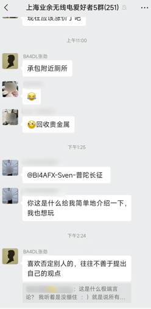
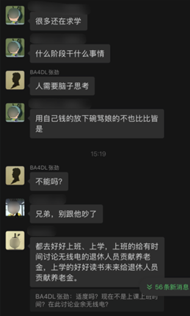
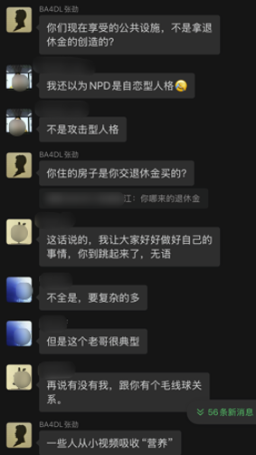

### 本次事件的两位主角

BA4DL 张劲   （上海市业余无线电受邀讲师）

BD4AAF 杨法（上海市业余无线电协会副秘书长）

### 事件核心起因及处理态度

该起事件发生于 “上海业余无线电爱好者5群” 由群主 BD4AAF（杨法）创建和管理。

BD4AAF 在群公告中明确指出了，**发言内容勿恶意挑动负面情绪**

BA4DL 于 10月16日 23:54 分发布不当言论

内容如下：

---

### 处理结果

----

我们先来说说张老师的问题吧：

1. 张老师的名声在上海本地的ham圈可以说是如雷贯耳，以阴阳怪气，难为新人出名。
2. 张老师令人咋舌的金句频出。
3. 张老师好于挤兑他人来获得心灵上的满足。
4. 在本次事件中的言论，称所有的ham都是事业无成、孩子不理、老婆无话、闲的无事，才玩无线电的；且所有ham均为社恐，称电台上侃侃而谈线下实则闷葫芦一枚。
5. 据消息称，张老师已经在上海的业余无线电群中多次发表过不当言论。
6. 对于上海市本地化的业余无线电爱好者的交流氛围生态，可以说的上是毁灭性的打击。
7. 姑且叫你一声张老师，但是你的师德呢？

我们再来聊聊杨法在这件事上的问题：

1. 在这个言论发出之后，并没有第一事件的指出言论问题，反而选择性无视。
2. 在此次事件中直接对发起异议的ham说 不喜欢张老师的可以转到3群去，以非常简单粗暴且一刀切的方式针对有异议的ham。
3. 自始至终都在偏袒张劲一方，并没有在ham群体中维持应有的公平。
4. 直至事情始终，杨法对于张劲的约束基本等于没有，更多的是对于新人，对于异议发起者的约束。
5. 一口否定该言论不是挑动负面情绪，且让异议者自己思考是否多心了。
6. 张劲的事件在上海业余无线电中已经多次发生，但为何上海市业余无线电协会没有加强管理反而任他为所欲为。

-----

### 该事件具体始末 (该图片顺序由时间顺序依次拼接)

# 最后张劲，得了便宜还卖乖，给大伙恶心吐了，像小孩子。
